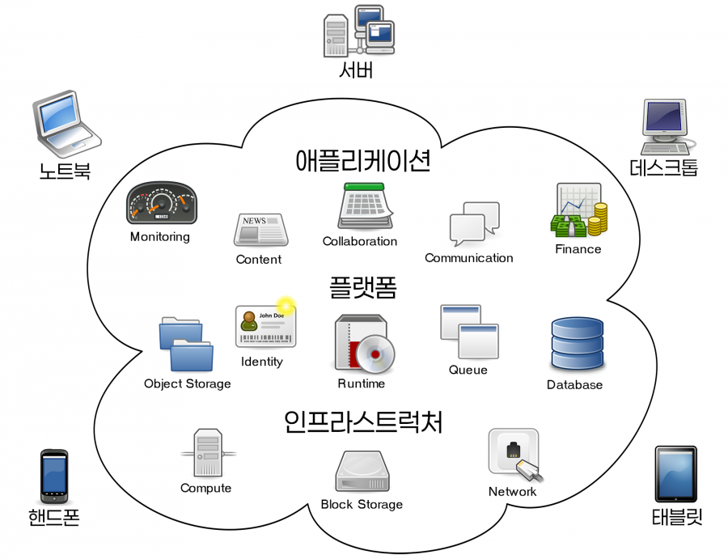

## 1. 클라우드란?

클라우드(Cloud)라는 단어는 사실 클라우드 컴퓨팅(Cloud Computing)을 짧게 줄여서 부르는 말입니다.
인터넷을 통해 제공되는 서버/스토리지/네트워크/소프트웨어 등 모든 IT자원을 필요한 만큼 사용하는 시스템.

## 2. 클라우드 컴퓨팅의 탄생배경

가장 기본적인 이유에는 바로 “컴퓨터의 발전” 이 있습니다.

- **서버 자원 낭비의 해결**

  기업이 자체 서버(온프레미스)를 구축하면 최대 트래픽을 기준으로 서버를 마련해야 하므로 평상시에는 하드웨어의 80%이상의 유휴 상태로 방치되는 문제가 발생하여 이를 해결하기 위함.

- **초기 비용 절감과 유연성**

  인프라를 직접 구매하거나 유지보수, 전력 소모 비용을 들이는 대신, 사용한 만큼만 요금을 지불 하여 비용을 최적화하고 필요할 때 즉시 서버를 확장하기 위해 탄생했습니다.

- **가상화 기술의 발전**

  물리적 서버 하나에 여러 가상 머신(VM)을 구동할 수 있는 기술이 발전하면서, 자원을 효율적으로 쪼개어 여러 사용자에게 서비스로 제공할 수 있는 기술적 토대가 마련되었습니다.

- **상용 클라우드 서비스의 등장**

  2000년대 초반 세일즈포스의 클라우드 기반 CRM 서비스 를 거쳐, 2006년 **아마존 웹 서비스(AWS)** 가 유휴 자원을 임대해 주는 형태로 최초의 범용 클라우드 서비스를 시작하며 시장이 급성장했습니다.

## 3. 왜 클라우드 서비스를 이용해야 하는가?

- 서비스를 이용한 만큼만 비용을 지불한다.
  서비스를 제공하기 위해 인프라 구축을 위한 자본을 투자하지 않아도 된다. 클라우드 서비스를 이용하고, 이용한만큼 비용을 지불하면 된다.

- 인프라 자체 구축보다 저렴하다.
  인프라를 자체 구축하는 것보다 비용이 저렴하다. 클라우드 서비스 사업자들이 규모의 경제를 이뤄 서비스 제공 비용을 낮췄기 때문이다.

- 비용의 낭비가 없다.
  유휴 자원이 발생하지 않기 때문에 비용낭비가 없다. 인프라가 필요할 때 필요한 만큼 늘리면 되고, 다 사용한 후 다시 반납하면 된다.

- 신속하게 움직일 수 있다.
  서비스를 제공하기 위한 의사결정 후 신속하게 움직일 수 있다. 과거에는 서버를 증설하기 위해 12~18주가 필요했고, 인프라 구축/유지 인력을 고용해야 했다. 클라우드는 바로 인프라를 구축할 수 있고, 관련 인력 채용도 최소화할 수 있다.

- 쉽게 사용이 가능하다.
  쉽게 사용할 수 있다. 어떤 기업과 스타트업도 표준화된 규격에 맞춰 서비스를 설계하고, 제공할 수 있다.
- 글로벌 서비스를 제공할 수 있다.
  글로벌 시장에 빠르게 진출할 수 있다. 대부분의 퍼블릭 클라우드가 글로벌 단위로 서비스를 제공하기 때문에 해외 인프라 구축 없이도 글로벌 서비스를 제공할 수 있다.
