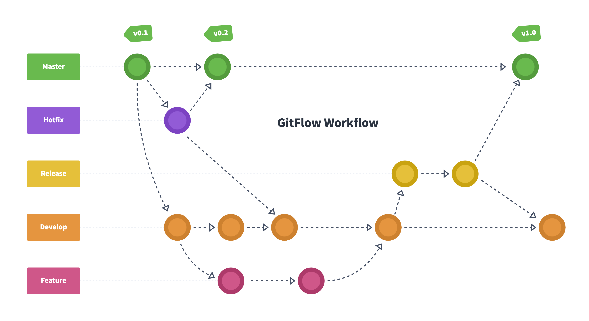
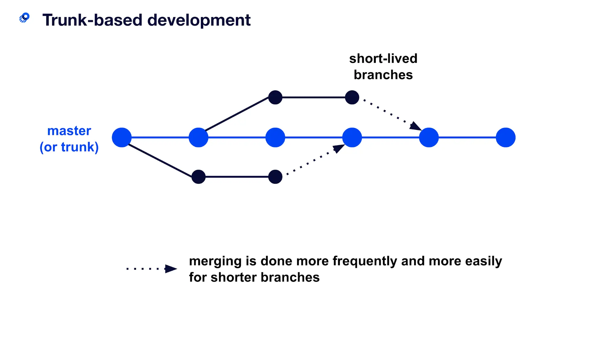

## Git Flow

- main/master branch - 빌드와 배포를 수행하는 브랜치
- develop branch - 다음 출시 버전을 진행하는 브랜치
- feature branch - 새로운 기능을 개발하는 브랜치. 작업 후 develop branch에 merge.
- hotfix branch - 출시 버전에서 발생한 버그를 수정 하는 브랜치
- release branch - 이번 출시 버전을 준비하는 브랜치

 
git-flow는 안정적인 릴리즈와 버그 관리에 효과적이지만, 브랜치가 많아져
복잡해지는 단점이 있다. 주로 프로젝트가 안정적인 release를 유지할 때 사용하는
전략.
 
 

## Trunk-based

메인 브랜치(master 또는 main)에서 개발을 진행하는 전략. 모든 변경사항은 메인 브랜치에 직접 병합되며, 간단하고 빠른 배포와 신속한 피드백을 가능하게 하지만, 릴리즈 버전 관리가 어렵고 충돌이 발생할 가능성, 충돌 해결과 테스트를 자주 수행해야한다.

 

## 어떤 전략을 쓰는게 좋을까?

프로젝트의 규모, 복잡도, 인원 수, 릴리즈 주기 등에 따라서 적합한 전략이 다르다.

- git-flow: 큰 프로젝트에서 안정적인 릴리즈와 버그 관리가 필요한 경우에 적합하다. 브랜치가 많아지는 단점이 있지만, 개발자들이 독립적으로 작업을 진행할 수 있어 개발 속도가 빨라질 수 있다.

- trunk-based: 릴리즈 주기가 짧은 작은 프로젝트에서 사용하기 적합하다. 코드의 품질과 충돌 관리에 대한 책임이 개발자에게 있기 때문에, 신속한 피드백과 개발 속도가 필요한 경우에 유용하다.
