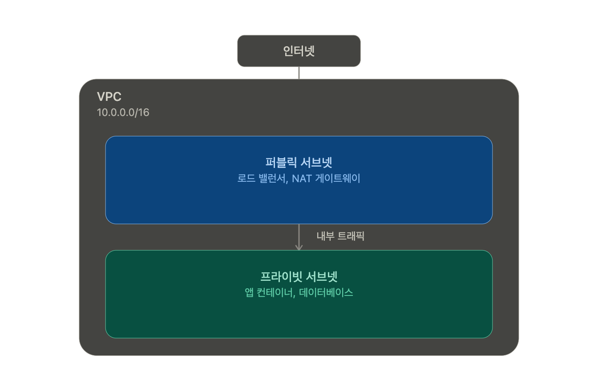
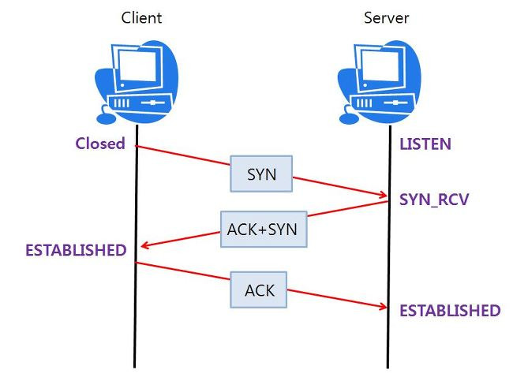
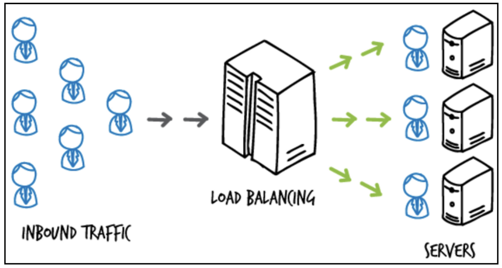

## IP주소 / 서브넷 / CIDR

**IP주소** : 서버를 식별하는 주소. 공인 IP와 사설 IP로 구분

```
공인 IP : 인터넷에서 직접 접근이 가능하다. (ex: 45. 160. 12. 34)
사설 IP : 내부 네트워크에서만 사용가능하다. (외부 접근 불가)
```

**서브넷** : 큰 네트워크를 작게 쪼갠 단위. 보통 Public Subnet(인터넷 직접 노출, LB용)과 Private Subnet(DB·내부 서버용, 외부 직접 접근 차단)으로 나눔

| 대역           | 용도                                         |     |
| -------------- | -------------------------------------------- | --- |
| 127.0.0.0/8    | 루프백 (localhost). 자기 자신과 통신         |     |
| 169.254.0.0/16 | 링크 로컬 (APIPA). DHCP 실패 시 자동 할당    |     |
| 100.64.0.0/10  | CGN (Carrier-Grade NAT). ISP 내부에서 사용   |     |
| 0.0.0.0/0      | 모든 IP를 의미 (라우팅/방화벽 규칙에서 사용) |     |

**CIDR** : `10.0.0.0/16` 같은 표기로 네트워크 대역을 정의. Terraform에서 VPC나 서브넷 만들 때 반드시 씀

```
192.168.1.0/24
└── 24비트가 네트워크 주소, 나머지 8비트가 호스트 주소
→ 호스트 수: 2^8 - 2 = 254개
```

## DNS

도메인 네임 시스템은 호스트의 도메인네임 (www.example.com)을 네트워크주소 (192. 168. 1. 0)로 변환하거나, 그 반대의 역활을 수행하는 시스템이다.

**DNS 동작 방식**

```
1. 브라우저 캐시 확인
2. OS 캐시 확인 (/etc/hosts)
3. DNS Resolver (ISP 또는 8.8.8.8)에 질의
4. Root DNS → TLD DNS (.dev) → 권한 DNS 서버 순으로 찾아감
5. IP 주소 반환 → 캐시에 저장 (TTL 동안)
```

**레코드 종류**

| 레코드 종류            | 내용                              |
| ---------------------- | --------------------------------- |
| A(IPv4 호스트)         | 도메인 주소를 IP주소(IPv4)로 매핑 |
| AAA(IPv6 호스트)       | 도메인 주소를 IP주소(IPv6)로 매핑 |
| CNAME(별칭)            | 도메인 주소에 대한 별칭           |
| SOA(권한 시작)         | 본 영역 데이터에 대한 권한        |
| NS(도메인의 네임 서버) | 본 영역에 대한 네임서버           |
| MX(메일 교환기)        | 도메인에 대한 메일 서버 정보      |
| PRT(포인터)            | IP주소를 도메인에 매핑(역방향)    |
| TXT(레코드)            | 도메인에 대한 일반 텍스트         |

## TCP vs UDP

**TCP**

TCP(Trasmission Control Protocol)는 연결 지향적 프로토콜입니다. 연결 지향 프로토콜이란 클라이언트와 서버가 연결된 상태에서 데이터를 주고받는 프로토콜을 의미합니다. 클라이언트가 연결 요청(SYN 데이터 전송)을 하고, 서버가 연결을 수락하면 통신 선로가 고정되고, 모든 데이터는 고정된 통신 선로를 통해서 순차적으로 전달됩니다. 그렇기 때문에 TCP는 데이터를 정확하고 안정적으로 전달할 수 있습니다. TCP는 호스트간 신뢰성 있는 데이터 전달과 흐름제어를 합니다. TCP 프로토콜은 신뢰성 있는 데이터의 전송을 위해 확인작업을 거치는데 TCP는 패킷을 성공적으로 전송하면(ACK) 라는 신호를 날리고 만약에 ACK 신호가 제 시간에 도착하지 않으면 Timeout이 발생하여 패킷 손실이 발생한 패킷을 다시 전송해줍니다. TCP는 이렇게 데이터를 송신할때마다 확인 응답을 주고받는 절차가 있으므로 통신의 신뢰성이 올라갑니다. 주로 lient와 Server 또는 P2P Socket 통신 등, 네트워크를 사용한 통신을 할 때 TCP 통신을 많이 사용합니다.

**TCP의 특징**

1. 연결형 (connnection-oriented) 서비스로 연결이 성공해야 통신이 가능하다.
2. 데이터의 경계를 구분하지 않는다. (바이트 스트림 서비스)
3. 데이터의 전송 순서를 보장한다. (데이터의 순서 유지를 위해 각 바이트마다 번호를 부여)
4. 신뢰성있는 데이터를 전송한다. (Sequence Number, Ack Number를 통한 신뢰성 보장)
5. 데이터 흐름 제어(수신자 버퍼 오버플로우 방지) 및 혼잡 제어(패킷 수가 과도하게 증가하는 현상 방지)
6. 연결의 설정(3-way handshaking)과 해제(4-way handshaking)
7. 전이중(Full-Duplex), 점대점(Point to Point) 서비스
8. UDP보다 전송속도가 느리다.

**3way handshake 방식(SYN, ACK)**



**연결 과정**

1. Client에서 Server에 연결 요청을 하기위해 SYN 데이터를 보낸다.
2. Server에서 해당 포트는 LISTEN 상태에서 SYN 데이터를 받고 SYN_RCV로 상태가 변경된다.
3. 그리고 요청을 정상적으로 받았다는 대답(ACK)와 Client도 포트를 열어달라는 SYN 을 같이 보낸다.
4. Client에서는 SYN+ACK 를 받고 ESTABLISHED로 상태를 변경하고 서버에 ACK 를 전송한다.
5. ACK를 받은 서버는 상태가 ESTABLSHED로 변경된다.

```
TCP state (netstat 명령어를 통해 확인가능)

- LISTEN : 서버의 데몬이 떠서 접속 요청을 기다리는 상태
- SYN-SENT : 로컬의 클라이언트 어플리케이션이 원격 호스트에 연결을 요청한 상태
- SYN_RECEIVED : 서버가 원격 클라이언트로부터 접속 요구를 받아 클라이언트에게 응답을 하였지만 아직 클라이언트에게 확인 메시지는 받지 않은 상태
- ESTABLISHED : 3 way-handshaking 이 완료된 후 서로 연결된 상태
- FIN-WAIT1, CLOSE-WAIT, FIN-WAIT2 : 서버에서 연결을 종료하기 위해 클라이언트에게 종결을 요청하고 회신을 받아 종료하는 과정의 상태
- TIME-WAIT : 연결은 종료되었지만 분실되었을지 모를 느린 세그먼트를 위해 당분간 소켓을 열어두고 있는 상태
- CLOSING : 흔하지 않지만 주로 확인 메시지가 전송도중 분실된 상태
- CLOSED : 완전히 종료
```

**UDP**

UDP(User Datagram Protocol)는 전송계층의 비연결 지향적 프로토콜입니다. 비연결 지향적이란 데이터를 주고받을 때 연결 절차를 거치지 않고 발신자가 일방적으로 데이터를 발신하는 방식을 의미합니다. 연결 과정이 없기 때문에 TCP보다는 빠른 전송을 할 수 있지만 데이터 전달의 신뢰성은 떨어집니다. UDP는 발신자가 데이터 패킷을 순차적으로 보내더라도 이 패킷들은 서로 다른 통신 선로를 통해 전달 될 수 있습니다. 먼저 보낸 패킷이 느린 선로를 통해 전송될 경우 나중에 보낸 패킷보다 늦게 도착할 수 있으며 최악의 경우 잘못된 선로로 전송되어 유실될 수도 있습니다. 이럴 경우 TCP와는 다르게 UDP는 중간에 패킷이 유실이나 변조가 되어도 재전송을 하지 않습니다.

**UDP의 특징**

1. 비연결형 서비스로 연결 없이 통신이 가능하며 데이터그램 방식을 제공한다.
2. 데이터 경계를 구분한다. (데이터그램(datagram) 서비스)
3. 정보를 주고 받을때 정보를 보내거나 받는다는 신호절차를 거치지 않는다.
4. 신뢰성 없는 데이터를 전송한다. (데이터 재전송과 데이터 순서 유지를 위한 작업을 하지 않는다.
5. 패킷관리가 필요하다.
6. 패킷 오버헤드가 적어 네트워크 부하가 감소되는 장점.
7. 상대적으로 TCP보다 전송속도가 빠르다.

**비교**

|                | TCP               | UDP                            |
| -------------- | ----------------- | ------------------------------ |
| 연결방식       | 연결형 서비스     | 비 연결형 서비스               |
| 패킷 교환 방식 | 가상 회선 방식    | 데이터그램 방식                |
| 전송 순서      | 전송 순서 보장    | 전송 순서가 바뀔 수 있음       |
| 수신 여부 확인 | 수신여부를 확인함 | 수신여부를 확인하지 않음       |
| 통신 방식      | 1:1 통신만 가능   | 1:1 / 1:N / N:N 통신 모두 가능 |
| 신뢰성         | 높음              | 낮음                           |
| 속도           | 느림              | 빠름                           |

## 방화벽과 보안 그룹

**방화벽**

방화벽(Firewall)은 네트워크 보안 장치 또는 소프트웨어로, 외부 네트워크와 내부 네트워크 간의 트래픽을 관리하고 제어하고 비인가된 접근이나 공격으로부터 네트워크를 보호하는 역할을 합니다. 방화벽은 허용된 트래픽은 통과시키고, 비허용된 트래픽은 차단하는 필터 역할을 합니다.

**보안그룹**

보안 그룹은 AWS VPC환경에서 EC@, RDS 등 개별 리소스에 직접 연결되는 가상 방화벽입니다. 이는 전통적인 네트워크 ACL과는 달리 상태 저장(Stateful)이라는 특성을 가지고 있습니다.

```
인바운드 규칙:
HTTP (80) → 0.0.0.0/0 (모든 곳에서 허용)
HTTPS (443) → 0.0.0.0/0
SSH (22) → 10.0.0.0/16 (내부망에서만)

아웃바운드 규칙:
All traffic → 0.0.0.0/0 (모든 곳으로 허용)
```

**NACL vs Security Group (AWS)**

| 항목        | 보안 그룹 (SG)       | 네트워크 ACL (NACL)        |
| ----------- | -------------------- | -------------------------- |
| 동작 방식   | 상태 저장 (Stateful) | 무상태 (Stateless)         |
| 적용 대상   | 리소스 단위          | 서브넷 단위                |
| 용도        | EC2, RDS 보호에 적합 | 서브넷 간 접근 제어에 적합 |
| 실무 활용도 | 매우 높음            | 특별한 경우에만 사용       |

## 로드 밸런서



어플리케이션은 여러 사용자의 요청들을 동시에 처리하고 안정적인 서비스를 제공해주어야한다. 물론 한 대의 서버로 성능을 계속 키워서 어느 정도는 커버(Scale-up)할 수 있겠지만, 이 방식은 얼마 안가서 한계를 만나게 된다. 따라서 여러 대의 서버를 둬서 요청 부하를 분산하도록 하는 것(Scale-out)이 로드 밸런싱이고 이 역할을 하는게 **로드 밸런서**이다.

로드 밸런서는 사용자와 서버 사이에 위치하며 모든 리소스 서버가 최적의 성능을 내도록 부하를 분산한다.

**로드 밸런서 종류**

1. **L2 / L3 :** MAC 주소(L2)나 IP 주소(L3)를 바탕으로 단순하게 트래픽을 경로 제어 및 분산하며 구조가 단순함.
2. **L4 (전송 계층):** 포트 번호 및 TCP/UDP 프로토콜 정보를 바탕으로 서버 간 부하를 분산하며 속도가 빠르고 비용이 비교적 저렴함.
3. **L7 (응용 계층):** HTTP, HTTPS, 쿠키 등 애플리케이션 수준의 세부 내용(URL, 쿠키 등)을 확인하여 섬세한 라우팅 및 비정상 서버 필터링이 가능함.

**로드 밸런서 알고리즘**

1. 라운드 로빈(Round Robin)

   클라이언트의 요청을 여러 대의 서버에 순차적으로 분배하는 방식이다. 추가적인 계산작업이 없이 들어온 요청을 빠르게 서버에 분산해 전송하는 1차원적인 주기능에 focus를 맞춘 방식이기 때문에 가장 많이 사용되는 로드 밸런싱 기법이다. 모든 서버의 스펙이 동일하거나 비슷한 경우에 사용된다.

2. 가중 라운드 로빈(Weighted Round Robin)

   각 서버에 처리량(가중치)를 지정한 후, 가중치가 높은 서버에 클라이언트 요청을 우선적으로 전달하는 방식이다. 주로 서버의 트래픽 처리 용량이 다를 경우, 즉 특정 서버의 스펙(사양)이 더 좋을 경우 사용된다. 예를 들어 A서버(가중치3)와 B서버(가중치1)가 있고 로드 밸런서가 클라이언트로부터 총 8개의 요청을 받았다면 A와 B 서버에 각 6개와 2개의 요청이 전달된다.

3. IP해시(IP Hash)

   클라이언트의 IP 주소가 어떤 서버로 클라의 요청이 전달될지를 결정하는 방식이다. 클라의 IP주소가 바뀌지 않으면 동일한 서버로 요청이 보내지는 것을 보장한다. RR방식과 달리 서버에 Session clustering이 구성되어 있지 않은 경우에 주로 사용한다.

4. 최소 연결(Least Connection)

   요청이 들어온 시점에 가장 적게 연결되어있는 서버에 요청을 전송하는 방식이다. 서버에 분배된 트래픽이 일정하지 않을 경우에 주로 사용한다.

5. 최소 응답 시간(Least Respnse Time)

   서버의 현재 연결 상태와 응답 시간을 모두 고려하여 가장 적은 연결 수와 가장 짧은 응답 시간을 가지는 서버에 우선적으로 요청을 보내는 방식이다.

## 프록시(Proxy)

프록시란 ‘대리’라는 의미를 지니고 있으며, 서버와 서버사이의 중계기 역할을 한다고 보면 된다. 프록시를 쓰는 이유는 보안상의 이유로 직접 통신할 수 없는 두 점사이에서 대리로 통신을 수행하여 보안성, 성능, 안정성을 향상 시키기 위해서이다.

**포워드 프록시 (Forward Proxy)**

같은 내부 망에 존재하는 클라이언트의 요청을 받아 인터넷을 통해 외부 서버에서 데이터를 가져와 클라이언트에게 응답해준다.
즉, 클라이언트가 서버에 접근하고자 할때, 클라이언트는 타겟 서버의 주소를 포워드 프록시에 전달하여, 포워드 프록시가 인터넷으로 요청된 내용을 가져오는 방식이다.
예를 들어 우리가 naver.com 을 요청하면 포워드 프록시 서버가 naver.com 리소스를 대신 받아와 클라이언트에게 내밀어준다(forward)고 생각하면 된다.

**리버스 프록시 (Reverse Proxy)**

리버스 프록시는 아래 그림 처럼 웹서버/WAS 앞에 놓여 있는 것을 말한다.
클라이언트는 웹서비스에 접근할때 웹서버에 요청하는 것이 아닌, 프록시로 요청하게 되고, 프록시가 배후(reverse)의 서버로부터 데이터를 가져오는 방식이다.
클라이언트쪽으로 데이터(response)를 밀어주는게 포워드라면, 그 반대편인 서버 쪽으로 데이터(request)를 밀어주는 것이 리버스 프록시 라고 보면 된다.

## API Gateway

**API Gateway란?**

규모에 상관없이 API 생성, 유지 관리, 모니터링과 보호를 할 수 있게 해주는 서비스이다.
말 그대로 Client에서 server로 통신할 때 사용하는 많은 api들의 대문(게이트웨이)과 같은 역할을 한다고 보면 된다. 즉, API가 지나가는 통로인 셈이다.

API Gateway를 이용하면 통합적으로 엔드포인트와 REST API를 관리할 수 있다.
API 게이트웨이를 등록해주면, 모든 클라이언트는 각 서비스의 엔드포인트 대신 API Gateway로 요청을 전달하여 관리가 용이해 진다. 사용자가 설정한 라우팅 설정에 따라 각 엔드포인트로 클라이언트를 대리하여 요청하고 응답을 받으면 다시 클라이언트에게 전달하는 프록시(proxy) 역할을 하기 때문이다.

API Gateway 서비스는 단순히 api 경유지 역할 뿐만 아니라, 엔드포인트 서버에서 공통으로 필요한 인증/인가, 사용량 제어, 요청/응답 변조 등의 다양한 기능을 플러그인 형태로 제공하고 있다. 이러한 플러그인을 API 게이트웨이에서 사용하면, 각 엔드포인트의 서버마다 위의 기능들을 구현하지 않아도 되기 때문에 개발자 입장에서는 개발 비용을 줄일 수 있다는 효과도 있다.
특히 API Gateway를 통해 Lambda와 연동하여 Serverless 서비스를 구축하는데 많이 사용된다.

## NAT Gateway

NAT 게이트웨이는 네트워크 주소 변환(NAT) 서비스입니다. NAT 게이트웨이를 사용하면 프라이빗 서브넷의 인스턴스가 VPC 외부의 서비스에 연결할 수 있지만 외부 서비스에서 이러한 인스턴스와의 연결을 시작할 수는 없도록 할 수 있습니다.

NAT 게이트웨이는 IPv4 또는 IPv6 트래픽에 사용됩니다(DNS64 및 NAT64 사용). IPv6를 통한 아웃바운드 전용 인터넷 통신을 활성화하는 다른 옵션은 외부 전용 인터넷 게이트웨이를 대신 사용하는 것입니다.

프라이빗 및 퍼블릭 NAT 게이트웨이는 모두 인스턴스의 소스 프라이빗 IPv4 주소를 NAT 게이트웨이의 프라이빗 IPv4 주소에 매핑하지만 퍼블릭 NAT 게이트웨이의 경우 인터넷 게이트웨이는 퍼블릭 NAT 게이트웨이의 프라이빗 IPv4 주소를 NAT 게이트웨이와 연결된 탄력적 IP 주소에 매핑합니다. 인스턴스에 응답 트래픽을 전송할 때 인스턴스는 퍼블릭 또는 프라이빗 NAT 게이트웨어 여부에 상관없이 NAT 게이트웨이는 주소를 원래 소스 IP 주소로 다시 변환합니다.

**Public**

프라이빗 서브넷의 인스턴스는 퍼블릭 NAT 게이트웨이를 통해 인터넷에 연결할 수 있지만 인스턴스가 인터넷에서 원치 않는 인바운드 연결을 수신할 수 없습니다. 퍼블릭 서브넷에서 퍼블릭 NAT 게이트웨이를 생성하고 생성 시 탄력적 IP 주소를 NAT 게이트웨이와 연결해야 합니다. 트래픽을 NAT 게이트웨이에서 VPC용 인터넷 게이트웨이로 라우팅합니다. 또는 퍼블릭 NAT 게이트웨이를 사용하여 다른 VPC 또는 온프레미스 네트워크에 연결할 수 있습니다. 이 경우 NAT 게이트웨이에서 Transit Gateway 또는 가상 프라이빗 게이트웨이를 통해 트래픽을 라우팅합니다.

**Private**

프라이빗 서브넷의 인스턴스는 프라이빗 NAT 게이트웨이를 통해 다른 VPC 또는 온프레미스 네트워크에 연결할 수 있지만 인스턴스가 다른 VPC나 온프레미스 네트워크에서 원치 않는 인바운드 연결을 수신할 수 없습니다. 트래픽을 NAT 게이트웨이에서 Transit Gateway 또는 가상 프라이빗 게이트웨이를 통해 트래픽을 라우팅할 수 있습니다. 탄력적 IP 주소를 프라이빗 NAT 게이트웨이에 연결할 수 없습니다. 프라이빗 NAT 게이트웨이를 사용하여 VPC에 인터넷 게이트웨이를 연결할 수 있지만 프라이빗 NAT 게이트웨이에서 인터넷 게이트웨이로 트래픽을 라우팅하는 경우 인터넷 게이트웨이가 트래픽을 삭제합니다.
