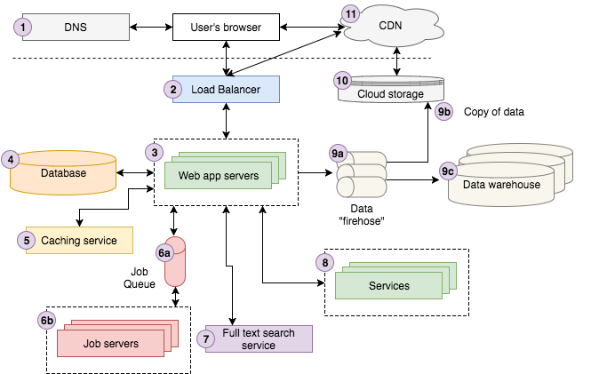
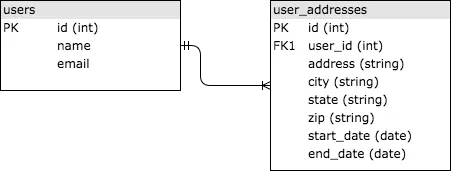
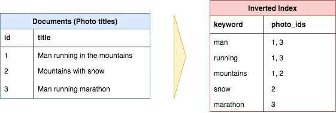
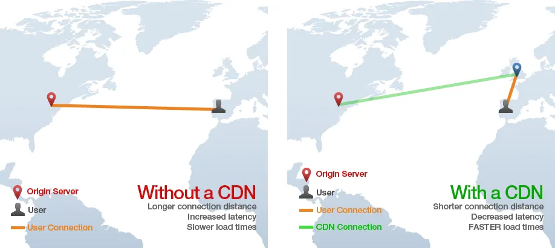

> 이 글은 Jonathan Fulton의 [Web Archtecture 101](https://medium.com/storyblocks-engineering/web-architecture-101-a3224e126947) 글을 보기 쉽게 번역한 글입니다.

위 다이어그램은 Storyblocks의 아키텍처를 상당히 잘 나타내고 있습니다. 만약 웹 개발 경험이 많지 않다면 복잡하게 느껴질 수 있습니다. 아래 안내를 통해 각 구성 요소의 세부 사항을 살펴보기 전에 더 쉽게 이해할 수 있을 것입니다.

> 사용자가 구글에서 "Strong Beautiful Fog And Sunbeams In The Forest "를 검색합니다. 첫 번째 검색 결과는 저희의 대표적인 스톡 사진 및 벡터 사이트인 Storyblocks의 이미지입니다. 사용자가 해당 결과를 클릭하면 브라우저가 이미지 상세 페이지로 이동합니다. 이때 사용자의 브라우저는 DNS 서버에 Storyblocks에 접속하는 방법을 문의한 후 요청을 보냅니다.  
> 요청이 로드 밸런싱기에 도달하면, 로드 밸런싱기는 해당 시점에 사이트를 실행 중인 10개 정도의 웹 서버 중 하나를 무작위로 선택하여 요청을 처리합니다.웹 서버는 캐싱 서비스에서 이미지에 대한 일부 정보를 조회하고 데이터베이스에서 나머지 데이터를 가져옵니다.이미지의 색상 프로필이 아직 계산되지 않았음을 확인하고, 작업 큐에 "색상 프로필" 작업을 보냅니다. 그러면 작업 서버가 해당 작업을 비동기적으로 처리하고 결과를 데이터베이스에 적절하게 업데이트합니다.  
> 다음으로, 사진 제목을 입력값으로 사용하여 전체 텍스트 검색 서비스에 요청을 보내 유사한 사진을 찾습니다. 해당 사용자는 Storyblocks 회원으로 로그인되어 있으므로 계정 서비스를 통해 계정 정보를 조회합니다. 마지막으로, 페이지 조회 이벤트를 데이터 전송 시스템에 전송하여 클라우드 스토리지 시스템에 기록하고, 최종적으로 데이터 웨어하우스에 로드합니다. 분석가들은 이 데이터를 활용하여 비즈니스 관련 질문에 대한 답변을 찾습니다.  
> 서버는 이제 뷰를 HTML로 렌더링하여 로드 밸런서를 거쳐 사용자 브라우저로 전송합니다. 페이지에는 클라우드 스토리지 시스템에 저장된 JavaScript 및 CSS 파일이 포함되어 있으며, 이 시스템은 CDN에 연결되어 있습니다. 따라서 사용자 브라우저는 CDN에 접속하여 콘텐츠를 가져옵니다. 마지막으로 브라우저는 사용자가 볼 수 있도록 페이지를 화면에 표시합니다.

다음으로는 각 구성 요소를 하나씩 살펴보면서 웹 아키텍처를 구상하는 데 도움이 될 기본적인 개념을 알려드리겠습니다. 이후에는 Storyblocks에서 쌓은 경험을 바탕으로 구체적인 구현 권장 사항을 제시하는 연재 기사를 이어갈 예정입니다.

## 1. DNS

DNS는 "도메인 이름 시스템(Domain Name System)"의 약자로, 월드 와이드 웹(WWW)을 가능하게 하는 핵심 기술입니다. 가장 기본적인 수준에서 DNS는 도메인 이름(예: google.com)과 IP 주소(예: 85.129.83.120)를 연결하는 키-값 관계를 제공하며, 이는 컴퓨터가 요청을 적절한 서버로 전달하는 데 필수적입니다. 전화번호에 비유하자면, 도메인 이름과 IP 주소의 차이는 "존 도에게 전화하기"와 "201-867-5309로 전화하기"의 차이와 같습니다. 옛날에 존의 전화번호를 찾기 위해 전화번호부가 필요했던 것처럼, 도메인의 IP 주소를 찾기 위해서는 DNS가 필요합니다.DNS는 인터넷의 전화번호부라고 생각하면 됩니다.  
더 자세히 설명할 부분도 많지만, 기초적인 소개에는 필수적인 내용이 아니므로 생략하겠습니다.

## 2. Load Balancer

로드 밸런싱에 대한 자세한 내용을 살펴보기 전에, 수평적 애플리케이션 확장과 수직적 애플리케이션 확장에 대해 잠시 논의해 보겠습니다. 둘은 무엇이며 어떤 차이가 있을까요? 이 [StackOverflow 게시물](https://stackoverflow.com/questions/11707879/difference-between-scaling-horizontally-and-vertically-for-databases) 에 아주 간단하게 설명되어 있습니다 .수평 확장은 리소스 풀에 머신을 추가하여 확장하는 것을 의미하며, 수직 확장은 기존 머신에 CPU나 RAM과 같은 성능 향상 요소를 추가하여 확장하는 것을 의미합니다.  
웹 개발에서는 (거의) 항상 수평 확장을 원합니다. 간단히 말해서,장비가 고장 나고, 서버가 갑자기 다운되고, 네트워크 성능이 저하되고, 데이터 센터 전체가 가끔씩 오프라인 상태가 되기도 합니다.여러 대의 서버를 보유하면 장애 발생 시에도 애플리케이션이 계속 실행될 수 있도록 대비할 수 있습니다. 즉, 애플리케이션이 "내결함성"을 갖추게 됩니다. 둘째로, 수평 확장을 통해 애플리케이션 백엔드의 각 부분(웹 서버, 데이터베이스, 서비스 X 등)을 서로 다른 서버에서 실행함으로써 각 부분의 결합도를 최소화할 수 있습니다. 마지막으로, 수직 확장이 더 이상 불가능한 규모에 도달할 수 있습니다. 세상에 애플리케이션의 모든 연산을 처리할 수 있을 만큼 큰 컴퓨터는 없습니다. 구글 검색 플랫폼을 대표적인 예로 들 수 있지만, 이는 훨씬 작은 규모의 회사에도 적용됩니다. 예를 들어, Storyblocks는 항상 150~400개의 AWS EC2 인스턴스를 실행합니다. 수직 확장을 통해 이 모든 연산 능력을 제공하는 것은 어려울 것입니다.  
자, 다시 로드 밸런싱 이야기로 돌아가 보죠. 로드 밸런싱은 수평 확장을 가능하게 하는 핵심 요소입니다. 들어오는 요청을 여러 애플리케이션 서버 중 하나로 라우팅하는데, 이 서버들은 일반적으로 서로 복제되거나 미러링된 형태입니다. 로드 밸런싱을 통해 애플리케이션 서버의 응답을 클라이언트로 다시 보냅니다. 어떤 서버를 선택하든 동일한 방식으로 요청을 처리하므로, 서버들이 과부하되지 않도록 요청을 여러 서버에 분산시키는 것이 중요합니다.  
이게 전부입니다. 로드 밸런싱은 개념적으로 상당히 간단합니다. 물론 내부적으로는 복잡한 부분이 있지만, 이 입문 버전에서는 굳이 자세히 살펴볼 필요는 없습니다.

## 3. Web Application Servers

웹 애플리케이션 서버는 개략적으로 설명하기 비교적 간단합니다. 사용자의 요청을 처리하고 HTML을 사용자의 브라우저로 전송하는 핵심 비즈니스 로직을 실행합니다. 이러한 작업을 수행하기 위해 일반적으로 웹 애플리케이션 서버는 다양한 백엔드 인프라와 통신합니다.데이터베이스, 캐싱 계층, 작업 큐, 검색 서비스, 기타 마이크로서비스, 데이터/로깅 큐 등위에서 언급했듯이, 일반적으로 사용자 요청을 처리하기 위해 최소 두 개, 많게는 그 이상의 서버가 로드 밸런서에 연결됩니다.  
애플리케이션 서버 구현에는 특정 언어(Node.js, Ruby, PHP, Scala, Java, C# .NET 등)와 해당 언어에 맞는 웹 MVC 프레임워크(Node.js용 Express, Ruby on Rails, Scala용 Play, PHP용 Laravel 등)를 선택해야 한다는 점을 알아두셔야 합니다. 하지만 이러한 언어와 프레임워크에 대한 자세한 설명은 이 글의 범위를 벗어납니다.

## 4. Database Servers

모든 최신 웹 애플리케이션은 정보를 저장하기 위해 하나 이상의 데이터베이스를 활용합니다. 데이터베이스는 데이터 구조를 정의하고, 새로운 데이터를 삽입하고, 기존 데이터를 검색하고, 업데이트하거나 삭제하고, 데이터에 대한 연산을 수행하는 등 다양한 작업을 가능하게 합니다. 대부분의 경우 웹 애플리케이션 서버와 작업 서버는 데이터베이스와 직접 통신합니다. 또한 각 백엔드 서비스는 애플리케이션의 나머지 부분과 격리된 자체 데이터베이스를 가질 수도 있습니다.  
각 아키텍처 구성 요소에 대한 특정 기술에 대해 자세히 설명하는 것은 피하겠지만, 데이터베이스의 경우 SQL과 NoSQL에 대한 자세한 내용을 언급하지 않는다면 여러분에게 도움이 되지 않을 것입니다.  
SQL은 "구조화 질의 언어(Structured Query Language)"의 약자로, 1970년대에 관계형 데이터 세트를 질의하는 표준 방식을 널리 보급하기 위해 개발되었습니다. SQL 데이터베이스는 공통 ID(일반적으로 정수)를 통해 서로 연결된 테이블에 데이터를 저장합니다. 사용자 주소 이력 정보를 저장하는 간단한 예를 살펴보겠습니다. 사용자 ID로 연결된 users 테이블과 user_addresses 테이블 두 개가 있다고 가정해 보겠습니다. 아래 이미지는 단순화된 예시입니다. user_addresses 테이블의 user_id 열이 users 테이블의 id 열에 대한 "외래 키" 역할을 하기 때문에 두 테이블이 연결됩니다.

SQL에 대해 잘 모르신다면, 칸 아카데미에서 제공하는 튜토리얼을 따라해 보시는 것을 강력히 추천합니다. SQL은 웹 개발에서 매우 중요하게 사용되므로, 애플리케이션을 제대로 설계하려면 최소한 기본 사항은 알아두는 것이 좋습니다.

NoSQL은 "Non-SQL"의 약자입니다. NoSQL은 대규모 웹 애플리케이션에서 생성되는 엄청난 양의 데이터를 처리하기 위해 등장한 새로운 데이터베이스 기술입니다(대부분의 SQL 변형은 수평 확장이 원활하지 않고 수직 확장도 일정 수준까지만 가능합니다). NoSQL에 대해 잘 모르신다면 다음과 같은 개론 자료부터 시작해 보시는 것을 추천합니다.

- https://www.w3resource.com/mongodb/nosql.php
- http://www.kdnuggets.com/2016/07/seven-steps-understanding-nosql-databases.html
- https://resources.mongodb.com/getting-started-with-mongodb/back-to-basics-1-introduction-to-nosql

또한 [업계](https://stackoverflow.com/questions/11707879/difference-between-scaling-horizontally-and-vertically-for-databases) 전반적으로 NoSQL 데이터베이스에서도 SQL을 인터페이스로 사용하는 추세 이므로 SQL을 모른다면 배우는 것이 좋습니다. 요즘에는 SQL을 피할 방법이 거의 없습니다.

## 5. Caching Service

캐싱 서비스는 간단한 키/값 데이터 저장소를 제공하여 O(1)에 가까운 시간 복잡도로 정보를 저장하고 조회할 수 있도록 합니다. 애플리케이션은 일반적으로 캐싱 서비스를 활용하여 비용이 많이 드는 계산 결과를 저장하고, 다음에 필요할 때 다시 계산하는 대신 캐시에서 결과를 가져옵니다. 애플리케이션은 데이터베이스 쿼리 결과, 외부 서비스 호출, 특정 URL에 대한 HTML 등을 캐시할 수 있습니다. 다음은 실제 애플리케이션의 몇 가지 예입니다.

- 구글은 "개"나 "테일러 스위프트"와 같은 일반적인 검색어에 대한 검색 결과를 매번 다시 계산하는 대신 캐시합니다.
- 페이스북은 로그인 시 표시되는 게시물 정보, 친구 목록 등 많은 데이터를 캐시합니다. 페이스북의 캐싱 기술에 대한 자세한 내용은 [여기](https://medium.com/@shagun/scaling-memcache-at-facebook-1ba77d71c082)에서 확인할 수 있습니다 .
- Storyblocks는 서버 측 React 렌더링, 검색 결과, 자동 완성 결과 등에서 생성된 HTML 출력을 캐시합니다.

가장 널리 사용되는 캐싱 서버 기술은 Redis와 Memcache입니다. 이에 대해서는 다른 게시물에서 더 자세히 다루겠습니다.

## 6. Job Queue & Servers

대부분의 웹 애플리케이션은 사용자의 요청에 직접 응답하는 것과는 별개로, 백그라운드에서 비동기적으로 여러 작업을 처리해야 합니다. 예를 들어, 구글은 검색 결과를 제공하기 위해 인터넷 전체를 크롤링하고 색인을 생성해야 합니다. 하지만 구글은 사용자가 검색할 때마다 이 작업을 수행하는 것이 아니라, 웹을 비동기적으로 크롤링하여 검색 색인을 지속적으로 업데이트합니다.  
비동기 작업을 가능하게 하는 다양한 아키텍처가 있지만, 가장 보편적인 것은 제가 "작업 큐" 아키텍처라고 부르는 것입니다. 이 아키텍처는 두 가지 구성 요소로 이루어져 있습니다. 하나는 실행해야 할 "작업"들의 큐이고, 다른 하나는 큐에 있는 작업들을 실행하는 하나 이상의 작업 서버(흔히 "워커"라고 함)입니다.  
작업 큐는 비동기적으로 실행해야 하는 작업 목록을 저장합니다.가장 간단한 방식은 선입선출(FIFO) 큐이지만, ​​대부분의 애플리케이션은 우선순위 기반 큐 시스템을 필요로 합니다. 애플리케이션은 정기적인 일정에 따라 또는 사용자 작업에 따라 실행해야 하는 작업이 있을 때마다 해당 작업을 큐에 추가하기만 하면 됩니다.  
예를 들어 Storyblocks는 작업 큐를 활용하여 마켓플레이스를 지원하는 데 필요한 많은 백그라운드 작업을 처리합니다. 비디오와 사진 인코딩, 메타데이터 태깅을 위한 CSV 처리, 사용자 통계 집계 등의 작업을 실행합니다.비밀번호 재설정 이메일을 보냅니다그 외에도 여러 가지가 있습니다. 처음에는 간단한 FIFO 큐를 사용했지만, 비밀번호 재설정 이메일 전송과 같이 시간에 민감한 작업이 최대한 빨리 완료되도록 우선순위 큐로 업그레이드했습니다.  
잡 서버는 작업을 처리합니다. 잡 서버는 작업 큐를 주기적으로 확인하여 처리할 작업이 있는지 확인하고, 작업이 있으면 큐에서 작업을 꺼내 실행합니다. 웹 서버와 마찬가지로 잡 서버 개발에 사용되는 언어와 프레임워크는 매우 다양하므로 이 글에서는 자세히 다루지 않겠습니다.

## 7. Full-text Search Service

대부분의 웹 앱은 사용자가 텍스트 입력(흔히 "쿼리"라고 함)을 제공하면 앱이 가장 "관련성 높은" 결과를 반환하는 검색 기능을 지원합니다. 이러한 기능을 구현하는 기술은 일반적으로 "[전체 텍스트 검색](https://en.wikipedia.org/wiki/Full-text_search)" 이라고 하며, 역인덱스를 활용하여 쿼리 키워드가 포함된 문서를 빠르게 검색합니다.

[일부 데이터베이스(예: MySQL은 전체 텍스트 검색을 지원)](https://dev.mysql.com/doc/refman/5.7/en/fulltext-search.html) 에서 직접 전체 텍스트 검색을 수행할 수 있지만 , 일반적으로 역인덱스를 계산 및 저장하고 쿼리 인터페이스를 제공하는 별도의 "검색 서비스"를 실행합니다. 오늘날 가장 널리 사용되는 전체 텍스트 검색 플랫폼은 [Elasticsearch](https://www.elastic.co/products/elasticsearch) 이지만 [Sphinx](http://sphinxsearch.com/) 또는 [Apache Solr](http://lucene.apache.org/solr/features.html) 과 같은 다른 옵션도 있습니다.

## 8. Services

앱이 일정 규모에 도달하면, 특정 "서비스"들을 분리하여 별도의 애플리케이션으로 실행하게 될 가능성이 높습니다. 이러한 서비스들은 외부에 노출되지는 않지만, 앱과 다른 서비스들이 상호 작용합니다. 예를 들어, Storyblocks에는 여러 개의 운영 중인 서비스와 계획된 서비스가 있습니다.

- 계정 서비스는 모든 사이트에 걸쳐 사용자 데이터를 저장하므로, 손쉽게 교차 판매 기회를 제공하고 더욱 통합된 사용자 경험을 제공할 수 있습니다.
- 콘텐츠 서비스는 당사의 모든 비디오, 오디오 및 이미지 콘텐츠에 대한 메타데이터를 저장합니다. 또한 콘텐츠를 다운로드하고 다운로드 기록을 볼 수 있는 인터페이스를 제공합니다.
- 결제 서비스는 고객의 신용카드로 결제할 수 있는 인터페이스를 제공합니다.
- HTML → PDF 서비스는 HTML을 입력받아 해당 PDF 문서를 반환하는 간단한 인터페이스를 제공합니다.

## 9. Data

오늘날 기업의 성패는 데이터를 얼마나 잘 활용하느냐에 달려 있습니다. 요즘 거의 모든 앱은 일정 규모에 도달하면 데이터 수집, 저장 및 분석을 위해 데이터 파이프라인을 활용합니다. 일반적인 파이프라인은 크게 세 단계로 구성됩니다.

1. 앱은 사용자 상호 작용과 관련된 이벤트 등의 데이터를 데이터 "파이어호스"로 전송합니다. 파이어호스는 데이터를 수집하고 처리하기 위한 스트리밍 인터페이스를 제공합니다. 원시 데이터는 종종 변환되거나 보강되어 다른 파이어호스로 전달됩니다. AWS Kinesis와 Kafka는 이러한 목적에 가장 일반적으로 사용되는 두 가지 기술입니다.
2. 원시 데이터와 최종 변환/증강 데이터는 클라우드 스토리지에 저장됩니다. AWS Kinesis는 "파이어호스(firehose)"라는 설정을 통해 원시 데이터를 클라우드 스토리지(S3)에 저장하는 작업을 매우 쉽게 구성할 수 있도록 지원합니다.
3. 변환/증강된 데이터는 분석을 위해 데이터 웨어하우스에 로드되는 경우가 많습니다. 저희는 AWS Redshift를 사용하고 있으며, 스타트업 업계의 상당 부분도 이를 사용하고 있습니다. 반면 대기업은 오라클이나 기타 자체 데이터 웨어하우스 기술을 사용하는 경우가 많습니다. 데이터 세트가 충분히 큰 경우, Hadoop과 유사한 NoSQL MapReduce분석을 위해서는 기술이 필요할 수 있습니다.

아키텍처 다이어그램에는 나와 있지 않지만, 앱과 서비스의 운영 데이터베이스에서 데이터 웨어하우스로 데이터를 로드하는 단계가 있습니다. 예를 들어 Storyblocks에서는 VideoBlocks, AudioBlocks, Storyblocks, 계정 서비스 및 기여자 포털 데이터베이스를 매일 밤 Redshift에 로드합니다. 이렇게 하면 핵심 비즈니스 데이터와 사용자 상호 작용 이벤트 데이터가 함께 저장되어 분석가들이 전체적인 데이터 세트를 활용할 수 있습니다.

## 10. Cloud storage

[AWS](https://aws.amazon.com/what-is-cloud-storage/)에 따르면 "클라우드 스토리지는 인터넷을 통해 데이터를 저장, 액세스 및 공유하는 간단하고 확장 가능한 방법"입니다 . 로컬 파일 시스템에 저장하는 거의 모든 데이터를 클라우드 스토리지를 통해 저장하고 액세스할 수 있으며, HTTP 기반 RESTful API를 통해 상호 작용할 수 있다는 장점이 있습니다. 아마존의 S3는 현재 가장 인기 있는 클라우드 스토리지 서비스이며, 스토리블록스에서도 비디오, 사진, 오디오 자료, CSS 및 자바스크립트, 사용자 이벤트 데이터 등을 저장하는 데 광범위하게 사용하고 있습니다.

## 11. CDN

CDN은 "콘텐츠 전송 네트워크(Content Delivery Network)"의 약자로, HTML, CSS, 자바스크립트, 이미지와 같은 정적 자산을 단일 원본 서버에서 제공하는 것보다 훨씬 빠르게 웹을 통해 제공하는 기술입니다. CDN은 콘텐츠를 전 세계 여러 "엣지" 서버에 분산시켜 사용자가 원본 서버가 아닌 엣지 서버에서 자산을 다운로드하도록 합니다. 예를 들어 아래 이미지에서 스페인의 사용자가 뉴욕에 원본 서버가 있는 웹사이트의 페이지를 요청하지만, 해당 페이지의 정적 자산은 영국에 있는 CDN "엣지" 서버에서 로드됩니다. 이렇게 하면 대서양을 건너는 느린 HTTP 요청을 여러 번 방지할 수 있습니다.

더 자세한 내용은 [이 글](https://www.creative-artworks.eu/why-use-a-content-delivery-network-cdn/)을 참고하세요. 일반적으로 웹 앱은 CSS, 자바스크립트, 이미지, 비디오 및 기타 모든 자산을 제공하기 위해 CDN을 사용하는 것이 좋습니다. 일부 앱은 정적 HTML 페이지를 제공하기 위해 CDN을 활용할 수도 있습니다.
